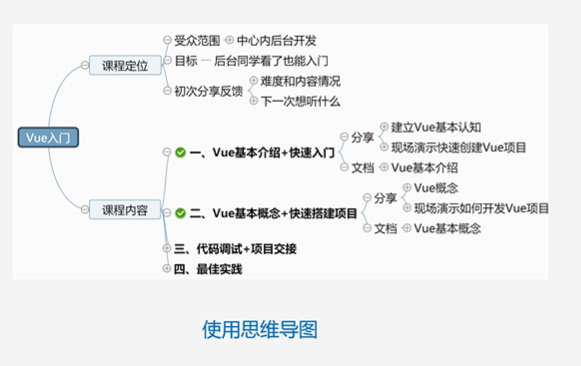
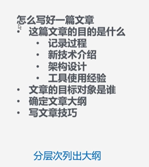

1. 为什么写

   1. 记性差，做记录回顾使用
   2. 思考，组织语言
   3. 分享，扩宽影响圈子，增加影响力
   4. 提升效率，输出文档

2. 文章目的是什么

   1. 某个问题的解决过程
      1. 问题描述
      2. 问题分析
      3. 解决过程
      4. 总结
   2. 对新知识、技术的理解
      1. 技术介绍、背景介绍
      2. 应用场景
      3. 技术对比、和现在已经存在的技术比较
      4. 自身思考
   3. 结构设计和解决方案
      1. 背景介绍
      2. 现状问题、为什么做这个解决方案
      3. 业界方案、别人是怎么做的
      4. 方案设计
      5. 执行过程、方案落地的过程
      6. 执行效果、是否达到最初的要求（如果性能优化则性能指标是什么）
      7. 未来规划
   4. 工具的使用经验
      1. 工具出现的背景
      2. 设计原理
      3. 解决了什么问题
      4. 工具说明
      5. 使用效果
      6. 踩坑记录

3. 文章的目标对象是哪些

   1. 自己
   2. 与我遇到同样问题的人
   3. 我的认知和其他人的认知
   4. 基础差距补充

4. 确认文章大纲

   1. 使用思维导图梳理文章大纲

      

   2. 分层次列出大纲

      

   3. 怎么写好一篇文章

      1. 这篇文章的目的是什么
         1. 记录过程
         2. 新技术介绍
         3. 架构设计
         4. 工具使用经验
      2. 文章的目标对象是谁
      3. 确定文章大纲
      4. 写文章技巧

   4. 写文章技巧

      1. 多进行概括和总结
         1. 在文章开头包含哪些内容，列出文章大纲
         2. 结束语，可以是文章总结或者个人想法、思考
      2. 避免一段文字太长，尽量让每个段落保持在4-6行的长度
      3. 适当地加入一些图片、图形，包括架构、时序、逻辑等
      4. 拆分步骤、分条列出，无序列表、有序列表等

5. 如何坚持写文章

   - 量变到质变
   - 进入良性循环
   - 将一件事变得更加有趣

